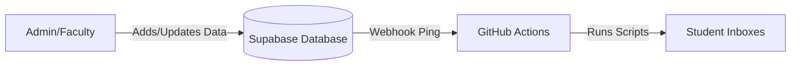

# CurricuLab Automated Notification Agent

This system runs silently in the background to ensure all students and faculty stay up-to-date with the latest changes in the CurricuLab ecosystem. It is **fully automated**, requiring no manual server management.

---

## 🏗️ How It Works

The system uses an **Event-Driven Architecture** to deliver notifications the moment something important happens.

1.  **Action**: You create an Assignment, Announcement, or Resource in your CurricuLab App.
2.  **Trigger**: Supabase detects the change types (`INSERT`, `UPDATE`, `DELETE`) and instantly wakes up the Agent.
3.  **Delivery**: The Agent formats a beautiful HTML email and sends it to all authorized users.

---

## 🎨 Visual Notification System

Emails are color-coded so recipients know exactly what kind of update it is at a glance:

| Color | Action | Example |
| :--- | :--- | :--- |
| 🔵 **Blue** | **New Item** | "✨ New Assignment: Physics 101" |
| 🟠 **Orange** | **Update** | "🔄 Updated Announcement: Exam Schedule" |
| 🔴 **Red** | **Deletion** | "🗑️ Removed Resource: Old Syllabus" |
| 🟣 **Purple**| **Reminder** | "📅 Action Required: Daily Attendance" |

---

## 🚀 How to Use

### For Administrators
Just use the **CurricuLab Dashboard** as you normally would.
*   **Create** an empty Assignment? → Students get a **Blue** email.
*   **Fix** a typo in an Announcement? → Students get an **Orange** email with the correction.
*   **Delete** a file? → Students get a **Red** notification.

### Daily Automations
The system also performs scheduled health checks and reminders independent of new data:
*   **7:00 PM & 9:00 PM**: Attendance Reminders are sent to all users who haven't logged their daily progress.
*   **Every 5 Minutes**: A safety checker runs to ensure no updates were missed during network hiccups.

---

## 🛠️ One-Time Setup

If you are setting this up for the first time, you need to connect your Database to your GitHub Repository.

👉 **[Read the Webhook Setup Guide](SUPABASE_WEBHOOK.md)**

---

## 📂 Repository Structure

*   `src/`: Core logic for fetching data and generating email HTML.
*   `scripts/`: One-off scripts ran by GitHub Actions (`check-updates.js`, `send-reminder.js`).
*   `.github/workflows/`: Configuration for the automation schedules.
